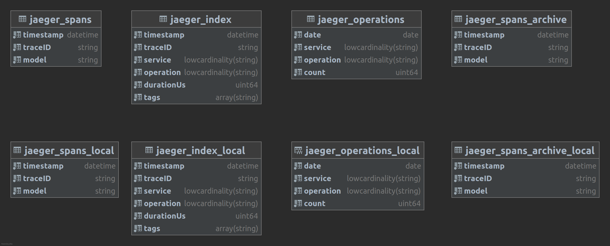

# Jaeger ClickHouse

This is a [Jaeger gRPC storage plugin](https://github.com/jaegertracing/jaeger/tree/master/plugin/storage/grpc) implementation for storing traces in ClickHouse.

## Project status

This is a community-driven project, and we would love to hear your issues and feature requests.
Pull requests are also greatly appreciated.

## Why use ClickHouse for Jaeger?

[ClickHouse](https://clickhouse.com) is an analytical column-oriented database management system.
It is designed to analyze streams of events which are kind of resemblant to spans.
It's open-source, optimized for performance, and actively developed.

## How it works

Jaeger spans are stored in 2 tables. The first contains the whole span encoded either in JSON or Protobuf.
The second stores key information about spans for searching. This table is indexed by span duration and tags.
Also, info about operations is stored in the materialized view. There are not indexes for archived spans.
Storing data in replicated local tables with distributed global tables is natively supported. Spans are bufferized.
Span buffers are flushed to DB either by timer or after reaching max batch size. Timer interval and batch size can be
set in [config file](./config.yaml).

Database schema generated by JetBrains DataGrip


# How to start using Jaeger over ClickHouse

## Documentation

Refer to the [config.yaml](./config.yaml) for all supported configuration options.

* [Kubernetes deployment](./guide-kubernetes.md)
* [Sharding and replication](./guide-sharding-and-replication.md)
* [Multi-tenancy](./guide-multitenancy.md)

## Build & Run

### Docker database example

```bash
docker run --rm -it -p9000:9000 --name some-clickhouse-server --ulimit nofile=262144:262144 clickhouse/clickhouse-server:22
GOOS=linux make build run
make run-hotrod
```

Open [localhost:16686](http://localhost:16686) and [localhost:8080](http://localhost:8080).

### Custom database

You need to specify connection options in `config.yaml`, then you can run

```bash
make build
SPAN_STORAGE_TYPE=grpc-plugin {Jaeger binary adress} --query.ui-config=jaeger-ui.json --grpc-storage-plugin.binary=./{name of built binary} --grpc-storage-plugin.configuration-file=config.yaml --grpc-storage-plugin.log-level=debug
```

## Credits

This project is originally based on [this clickhouse plugin implementation](https://github.com/bobrik/jaeger/tree/ivan/clickhouse/plugin/storage/clickhouse).

See also [jaegertracing/jaeger/issues/1438](https://github.com/jaegertracing/jaeger/issues/1438) for historical discussion regarding the implementation of a ClickHouse plugin.
