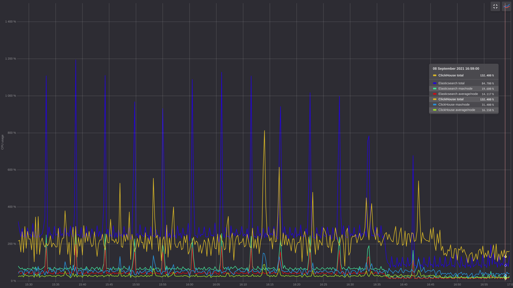
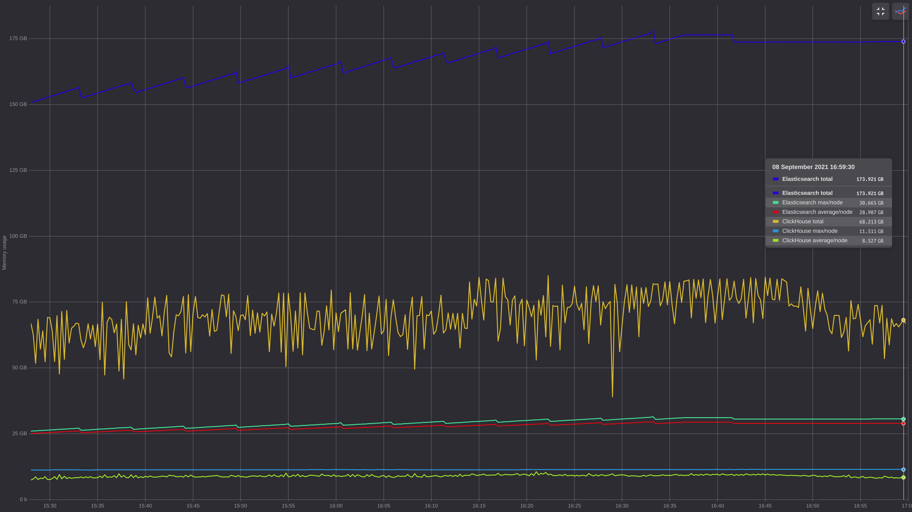
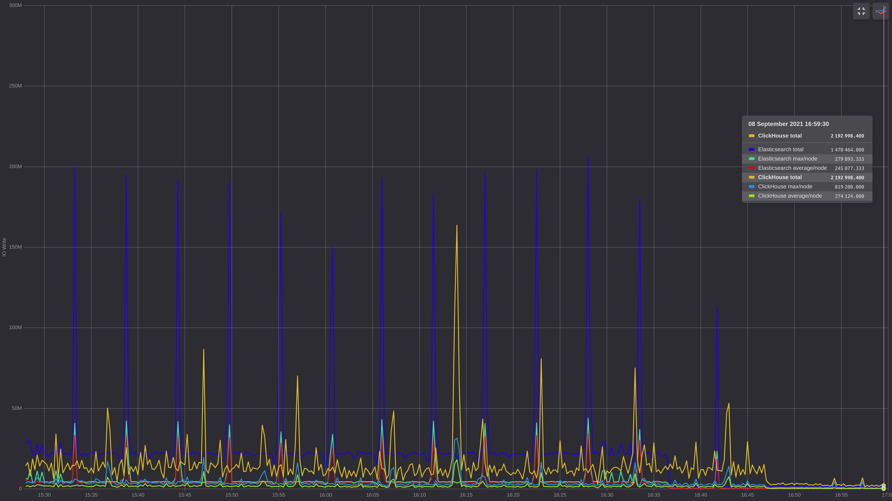
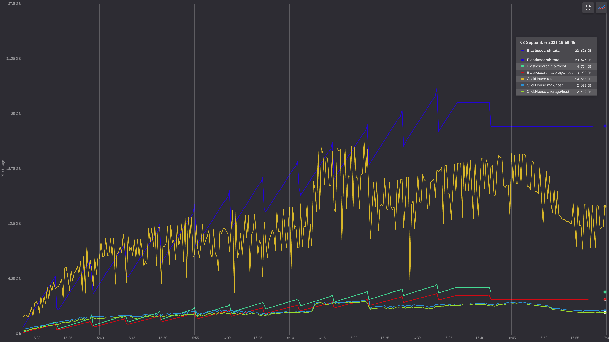

# Jaeger ClickHouse
This is an implementation of Jaeger's [storage plugin](https://github.com/jaegertracing/jaeger/tree/master/plugin/storage/grpc) for ClickHouse.
See as well [jaegertracing/jaeger/issues/1438](https://github.com/jaegertracing/jaeger/issues/1438) for historical discussion regarding Clickhouse plugin.

## Project status

Jaeger ClickHouse is a community-driven project, we would love to hear your feature requests.
Pull requests also will be greatly appreciated.

## Why use ClickHouse for Jaeger?

[ClickHouse](https://github.com/clickhouse/clickhouse) is an analytical column-oriented database management system. It is designed to analyze streams of clicks which are kind of resemblant to spans. It's open-source, optimized for performance, and actively developed.

## How does it work?

Jaeger spans are stored in 2 tables. First one contains whole span encoded either in JSON or Protobuf.
Second stores key information about spans for searching. This table is indexed by span duration and tags.
Also, info about operations is stored in the materialized view. There are no indexes for archived spans.
Storing data in replicated local tables with distributed global tables is natively supported. Spans are buffered.
Span buffers are flushed to DB either by timer or after reaching max batch size.
Timer interval and batch size can be set in [config file](../config.yaml).


## Benchmarks

10^8 traces were flushed using [jaeger-tracegen](https://www.jaegertracing.io/docs/1.25/tools/) to Clickhouse and ElasticSearch servers.
Clickhouse server consisted of 3 shards, 2 hosts in each, and 3 Zookeeper hosts. Elasticsearch server consisted of 6 hosts,
with 5 shards for primary index and 1 replica. All hosts were equal(8 vCPU, 32 GiB RAM, 20 GiB SSD).

### General stats

Cpu usage, [% of 1 host CPU]


Memory usage, [bytes]


IO write, [operations]


Disk usage, [bytes]


### Recorded

#### ClickHouse

```sql
SELECT count()
FROM jaeger_index
WHERE service = 'tracegen'

┌──count()─┐
│ 57026426 │
└──────────┘
```

#### Elasticsearch


# How to start using Jaeger over ClickHouse

## Documentation

Refer to the [config.yaml](../config.yaml) for all supported configuration options.

* [Kubernetes deployment](../guide-kubernetes.md)
* [Sharding and replication](../guide-sharding-and-replication.md)
* [Multi-tenancy](../guide-multitenancy.md)

## Build & Run

### Docker database example

```bash
docker run --rm -it -p9000:9000 --name some-clickhouse-server --ulimit nofile=262144:262144 clickhouse/clickhouse-server:24
GOOS=linux make build run
make run-hotrod
```

Open [localhost:16686](http://localhost:16686) and [localhost:8080](http://localhost:8080).

### Custom database

You need to specify connection options in config.yaml file, then you can run

```bash
make build
SPAN_STORAGE_TYPE=grpc-plugin {Jaeger binary adress} --query.ui-config=jaeger-ui.json --grpc-storage-plugin.binary=./{name of built binary} --grpc-storage-plugin.configuration-file=config.yaml --grpc-storage-plugin.log-level=debug
```

## Credits

This project is based on https://github.com/bobrik/jaeger/tree/ivan/clickhouse/plugin/storage/clickhouse.
